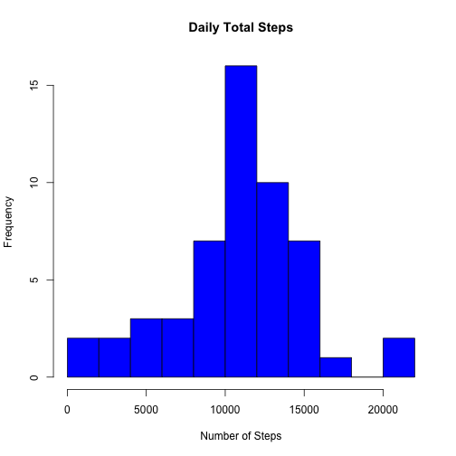
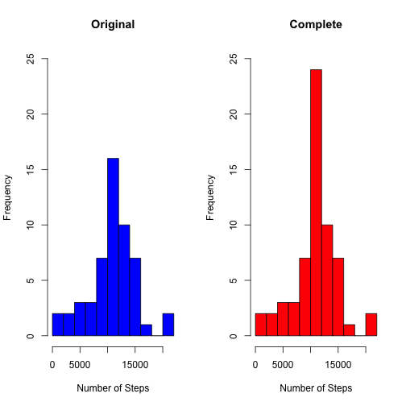
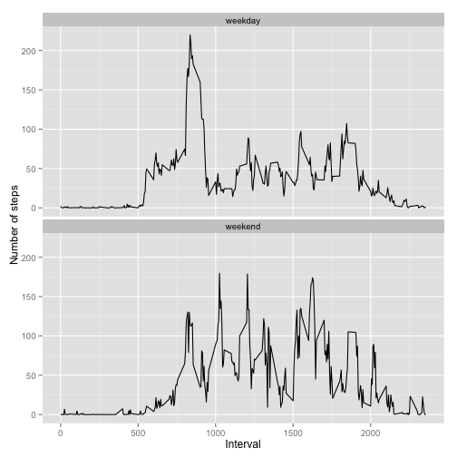

Peer Assessment 1
========================================================

Load the data

```r
draw <- read.csv("activity.csv")
```

## What is the mean total number of steps per day?
Sum the number of steps for each day

```r
stepsdaytotals <- aggregate(draw$steps, by = list(as.Date(as.character(draw$date))), FUN = sum)
colnames(stepsdaytotals) <- c("date", "steps")
```

Histogram of total steps per day

```r
hist(stepsdaytotals$steps,
     main = "Daily Total Steps",
     xlab = "Number of Steps",
     breaks = 10,
     col = "blue")
```

 

Mean and median total steps per day

```r
stepsdaytotals_mean <- mean(stepsdaytotals[,2], na.rm = TRUE)
stepsdaytotals_median <- median(stepsdaytotals[,2], na.rm = TRUE)
table1 <- data.frame(c(stepsdaytotals_mean, stepsdaytotals_median))
colnames(table1) <- c("Daily Step Total")
rownames(table1) <- c("mean", "median")
library(xtable)
print(xtable(table1), type="html")
```

<!-- html table generated in R 3.0.3 by xtable 1.7-3 package -->
<!-- Sun Jul 20 14:04:01 2014 -->
<TABLE border=1>
<TR> <TH>  </TH> <TH> Daily Step Total </TH>  </TR>
  <TR> <TD align="right"> mean </TD> <TD align="right"> 10766.19 </TD> </TR>
  <TR> <TD align="right"> median </TD> <TD align="right"> 10765.00 </TD> </TR>
   </TABLE>

## What is the average daily activity pattern?
Calculate average steps for each interval, removing NAs

```r
dna <- draw[complete.cases(draw$steps),]
stepsintmeans <- aggregate(dna$steps, by = list(dna$interval), FUN = mean)
colnames(stepsintmeans) <- c("Interval", "Steps")
```


```r
maxsteps <- max(stepsintmeans$Steps)
mrow <- which.max(stepsintmeans$Steps)
maxinterval <- stepsintmeans[mrow,1]
```

### The 5-minute interval 835 has the maximum average steps, 206.1698 steps.

Plot time series

```r
with(stepsintmeans, plot(Interval, Steps, 
                         type = "l",
                         main = "Average Steps by Interval"))
```

 

## Imputing missing values

Count number of rows with NA.

```r
narows <- sum(is.na(draw[,1]))
```

### There are 2304 missing values.

For filling in missing values, the average number of steps for each interval was calculated.

```r
dcomplete <- draw
drows <- nrow(dcomplete)
intmeans <- array(dim = length(2356))
for(i in 0:2355) {
  introws <- dcomplete[dcomplete$interval == i,]
  intmeans[i + 1] <- mean(introws$steps, na.rm = TRUE)
  i = i + 4
}
```

NAs were replaced with the average number of steps for that interval.

```r
for(i in 1:drows){
  if(is.na(dcomplete[i, 1]) == TRUE){
    int <- dcomplete[i, 3]
    dcomplete[i, 1] <- intmeans[int + 1]
  }
}
```

Calculate the total for each day for the new Complete dataset.

```r
stepsdaytotals_comp <- aggregate(dcomplete$steps, by = list(as.Date(as.character(dcomplete$date))), FUN = sum)
colnames(stepsdaytotals_comp) <- c("date", "steps")
```

Histogram of total steps per day, for Original and Complete data.

```r
par(mfrow = c(1,2))
hist(stepsdaytotals$steps, main = "Original", xlab = "Number of Steps", breaks = 10, ylim = c(0,25), col = "blue")
hist(stepsdaytotals_comp$steps, main = "Complete", xlab = "Number of Steps", breaks = 10, ylim = c(0,25), col = "red")
```

 

Mean and median total steps per day, for Original and Complete data.

```r
stepsdaytotals_mean_comp <- mean(stepsdaytotals_comp[,2])
stepsdaytotals_median_comp <- median(stepsdaytotals_comp[,2])
table2 <- data.frame(c(stepsdaytotals_mean, stepsdaytotals_median), c(stepsdaytotals_mean_comp, stepsdaytotals_median_comp))
colnames(table2) <- c("Original", "Complete")
rownames(table2) <- c("mean", "median")
print(xtable(table2), type="html")
```

<!-- html table generated in R 3.0.3 by xtable 1.7-3 package -->
<!-- Sun Jul 20 14:04:08 2014 -->
<TABLE border=1>
<TR> <TH>  </TH> <TH> Original </TH> <TH> Complete </TH>  </TR>
  <TR> <TD align="right"> mean </TD> <TD align="right"> 10766.19 </TD> <TD align="right"> 10766.19 </TD> </TR>
  <TR> <TD align="right"> median </TD> <TD align="right"> 10765.00 </TD> <TD align="right"> 10766.19 </TD> </TR>
   </TABLE>

## Are there differences in activity patterns between weekdays and weekends?

Create new factor variable, with levels "weekday" and "weekend"

```r
dcomplete$date <- as.Date(as.character(dcomplete$date))
for(i in 1:drows){
  if(identical(weekdays(dcomplete[i,2]), "Saturday") == TRUE){
    dcomplete[i,4] <- "weekend"
  } 
  if(identical(weekdays(dcomplete[i,2]), "Sunday") == TRUE){
    dcomplete[i,4] <- "weekend"
  } else {
    dcomplete[i,4] <- "weekday"
  }
}
colnames(dcomplete)[4] <- "day"
```

Calculate averages for each interval for weekends and weekdays

```r
dweekend <- dcomplete[dcomplete$day == "weekend",]
dweekday <- dcomplete[dcomplete$day == "weekday",]
stepsintmeans_weekend <- aggregate(dweekend$steps, by = list(dweekend$interval), FUN = mean)
colnames(stepsintmeans_weekend) <- c("Interval", "steps")
stepsintmeans_weekend$day <- "weekend"
stepsintmeans_weekday <- aggregate(dweekday$steps, by = list(dweekday$interval), FUN = mean)
colnames(stepsintmeans_weekday) <- c("Interval", "steps")
stepsintmeans_weekday$day <- "weekday"
stepsintmeans_day <- rbind(stepsintmeans_weekend, stepsintmeans_weekday)
```

Plot times series of average steps by interval for weekdays and weekends.

```r
library(ggplot2)
pday <- ggplot(stepsintmeans_day, aes(Interval, steps))
pday + geom_line() + facet_wrap(~day, ncol=1) + ylab("Number of steps")
```

 
